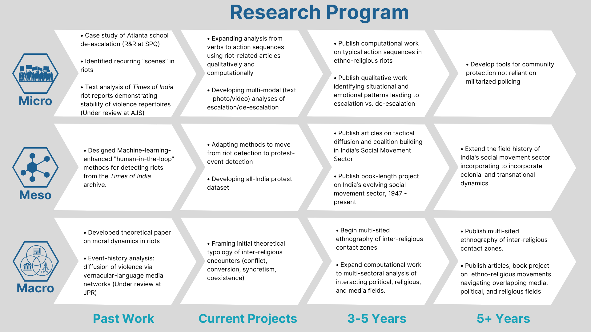

<section class="single" style="padding-bottom: 1rem;">

A brief statement of my research agenda is available [here](docs/Sorge_Research_Statement.pdf), and a more detailed version is available [here](docs/Sorge_Research_Statement_long.pdf)

</section>

<section class="portfolio" style="padding-top: 1rem;">

	

		
		

		

			<a class="portfolio-item__link" href="{{ project.url | relative_url }}">

				

					📊
';">
				

				

					

						<h2 class="portfolio-item__title">{{ project.title }}</h2>
						
{{ project.subtitle }}

					

				

			</a>

		

		

	

</section>

